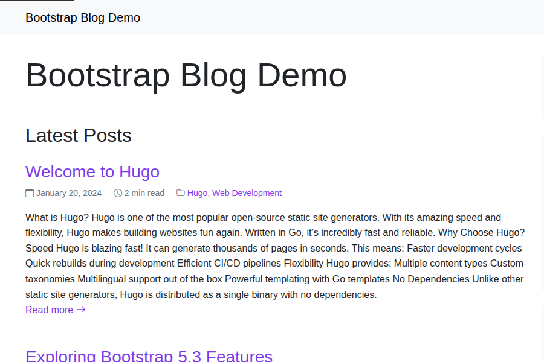

# Hugo Bootstrap Blog Theme

A clean, responsive Hugo theme for blogging with Bootstrap 5.3, featuring modular sidebar, dark mode, and i18n support.



## Features

- ✨ **Clean & Modern Design** - Minimalist design focused on readability
- 📱 **Fully Responsive** - Looks great on all devices
- 🌙 **Dark Mode** - Automatic and manual dark mode switching
- 🔧 **Modular Sidebar** - Customizable sidebar with various widgets
- 🌍 **Multilingual** - Built-in support for English and Japanese
- 🔍 **Search** - Client-side search with Lunr.js
- ⚡ **Fast** - Optimized for performance (Lighthouse 95+)
- ♿ **Accessible** - WCAG 2.1 AA compliant
- 🎨 **Bootstrap 5.3** - Latest Bootstrap framework
- 📊 **SEO Optimized** - Built-in SEO features and structured data

## Demo

View the live demo: [Hugo Bootstrap Blog Demo](https://hugo-bootstrap-blog.netlify.app)

## Requirements

- Hugo 0.120.0 or later
- Node.js 16+ (for building SCSS and running tests)

## Installation

### As a Git Submodule

```bash
git submodule add https://github.com/ngs/hugo-bootstrap-blog themes/hugo-bootstrap-blog
```

### Using Hugo Modules

1. Initialize Hugo Modules in your project:

```bash
hugo mod init github.com/yourusername/your-site
```

2. Add the theme to your `hugo.toml`:

```toml
[module]
  [[module.imports]]
    path = "github.com/ngs/hugo-bootstrap-blog"
```

## Quick Start

1. Copy the example site configuration:

```bash
cp themes/hugo-bootstrap-blog/exampleSite/hugo.toml .
```

2. Copy example content (optional):

```bash
cp -r themes/hugo-bootstrap-blog/exampleSite/content .
```

3. Start the Hugo server:

```bash
hugo server
```

## Configuration

### Basic Configuration

```toml
baseURL = "https://example.com/"
languageCode = "en"
title = "My Blog"
theme = "hugo-bootstrap-blog"
paginate = 10

[params]
  description = "A modern blog built with Hugo and Bootstrap"
  darkMode = true
  enableSearch = true
  showReadingTime = true
```

### Sidebar Modules

Configure which modules appear in the sidebar:

```toml
[params]
  sidebarPosition = "right" # "left" or "right"
  sidebarModules = [
    "search",
    "profile",
    "categories",
    "tags",
    "recent",
    "archives",
    "social"
  ]
```

Available modules:
- `search` - Search box
- `profile` - Author profile
- `categories` - Categories list
- `tags` - Tag cloud
- `recent` - Recent posts
- `archives` - Post archives
- `social` - Social links
- `toc` - Table of contents (single pages only)
- `related` - Related posts (single pages only)

### Author Information

```toml
[params.author]
  name = "John Doe"
  bio = "Web developer and blogger"
  avatar = "/images/avatar.jpg"
  email = "john@example.com"
```

### Social Links

```toml
[params.social]
  twitter = "https://twitter.com/username"
  github = "https://github.com/username"
  linkedin = "https://linkedin.com/in/username"
  facebook = ""
  instagram = ""
  youtube = ""
```

### Menu Configuration

```toml
[menu]
  [[menu.main]]
    name = "Home"
    url = "/"
    weight = 1
  
  [[menu.main]]
    name = "Posts"
    url = "/posts/"
    weight = 2
  
  [[menu.main]]
    name = "About"
    url = "/about/"
    weight = 3
```

## Multilingual Support

The theme supports multiple languages. Configure in `hugo.toml`:

```toml
defaultContentLanguage = "en"

[languages]
  [languages.en]
    languageName = "English"
    weight = 1
  
  [languages.ja]
    languageName = "日本語"
    weight = 2
```

## Content Structure

### Front Matter

```yaml
---
title: "Post Title"
date: 2024-01-15
description: "Post description"
categories: ["Tutorial"]
tags: ["Hugo", "Bootstrap"]
image: "/images/featured.jpg"
toc: true
author: "John Doe"
---
```

## Building for Production

1. Install dependencies:

```bash
npm install
```

2. Build SCSS:

```bash
npm run build
```

3. Build the site:

```bash
hugo --minify
```

## Development

### Build SCSS

```bash
npm run build:scss
```

### Watch SCSS

```bash
npm run watch:scss
```

### Run development server

```bash
npm run dev
```

### Generate screenshots

```bash
npm run screenshot
```

## Contributing

Contributions are welcome! Please feel free to submit a Pull Request.

1. Fork the repository
2. Create your feature branch (`git checkout -b feature/AmazingFeature`)
3. Commit your changes (`git commit -m 'Add some AmazingFeature'`)
4. Push to the branch (`git push origin feature/AmazingFeature`)
5. Open a Pull Request

## License

This theme is released under the [MIT License](LICENSE.md).

## Credits

- [Hugo](https://gohugo.io/)
- [Bootstrap](https://getbootstrap.com/)
- [Bootstrap Icons](https://icons.getbootstrap.com/)
- [Lunr.js](https://lunrjs.com/)

## Author

**Atsushi Nagase**
- Website: [https://ngs.io](https://ngs.io)
- GitHub: [@ngs](https://github.com/ngs)

## Support

If you find this theme useful, please consider:
- Starring the repository on GitHub
- Sharing it with others
- [Reporting issues](https://github.com/ngs/hugo-bootstrap-blog/issues)
- [Contributing](https://github.com/ngs/hugo-bootstrap-blog/pulls)